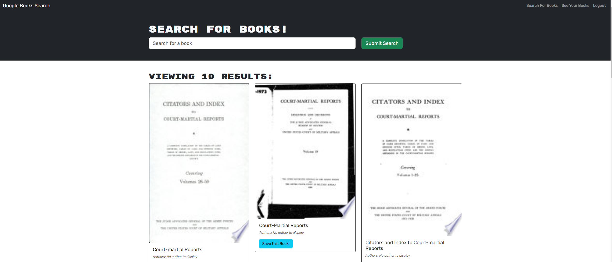
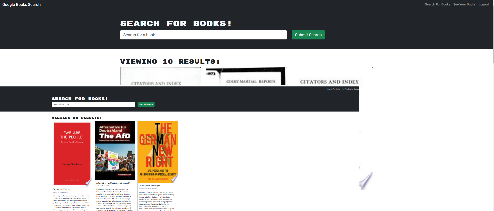
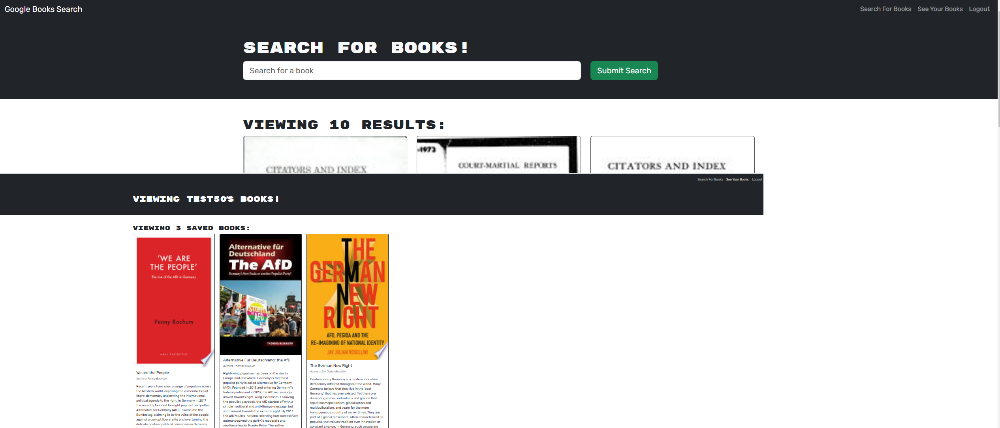
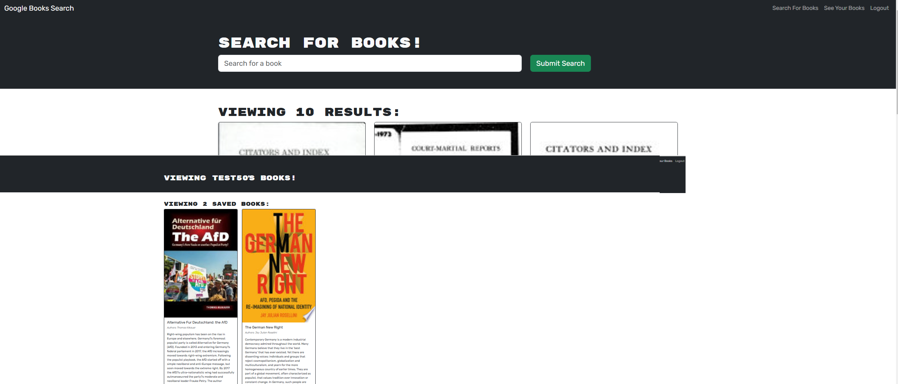

# Book-Search-Engine
This repository contains a refactor of an existing Google Books API search engine, transitioning it from a RESTful API to a GraphQL API using Apollo Server. The application is built with the MERN stack (MongoDB, Express.js, React, Node.js) and is designed to search for books via the Google Books API.

## Technologies

-React
-Node.js
-Express.js
-MongoDB
-Apollo Server

## Installation

npm install 

## Usage

To start the application, run the following command:

-npm run build
-npm run develop

# Github Link

https://github.com/Trinigch/Book-Search-Engine.git

##  Deploy Link

## Link to the deployed application

https://book-search-engine-1-3xpc.onrender.com

##  screenshot

  

  

  

  

## Credits

Trinidad Peterson - GitHub Username ----- Trinigch

## License
MIT License

Copyright (c) 2024 Trinidad

Permission is hereby granted, free of charge, to any person obtaining a copy of this software and associated documentation files (the "Software"), to deal in the Software without restriction, including without limitation the rights to use, copy, modify, merge, publish, distribute, sublicense, and/or sell copies of the Software, and to permit persons to whom the Software is furnished to do so, subject to the following conditions:

The above copyright notice and this permission notice shall be included in all copies or substantial portions of the Software.

THE SOFTWARE IS PROVIDED "AS IS", WITHOUT WARRANTY OF ANY KIND, EXPRESS OR IMPLIED, INCLUDING BUT NOT LIMITED TO THE WARRANTIES OF MERCHANTABILITY, FITNESS FOR A PARTICULAR PURPOSE AND NONINFRINGEMENT. IN NO EVENT SHALL THE AUTHORS OR COPYRIGHT HOLDERS BE LIABLE FOR ANY CLAIM, DAMAGES OR OTHER LIABILITY, WHETHER IN AN ACTION OF CONTRACT, TORT OR OTHERWISE, ARISING FROM, OUT OF OR IN CONNECTION WITH THE SOFTWARE OR THE USE OR OTHER DEALINGS IN THE SOFTWARE.

## Questions
 If you have any questions, feel free to contact me:

 - GitHub: Trinigch
 - Email: trinigch@gmail.com
